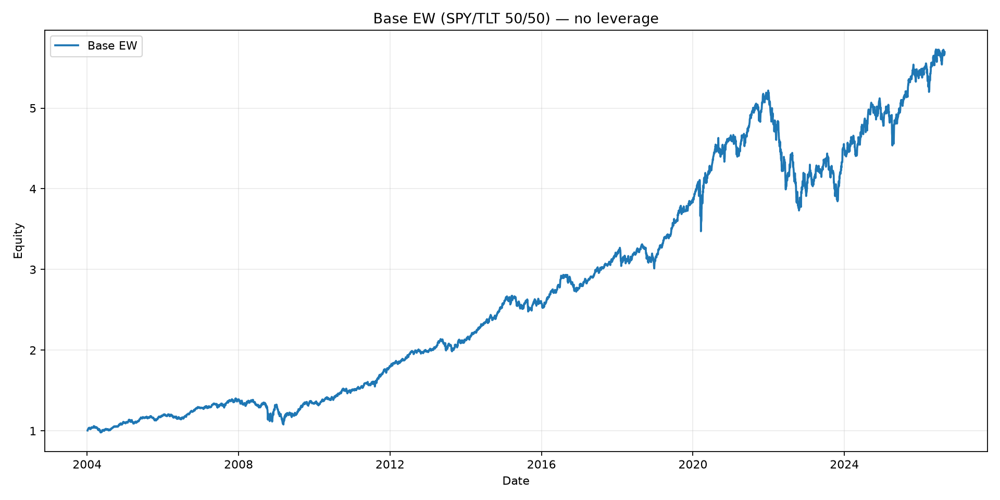
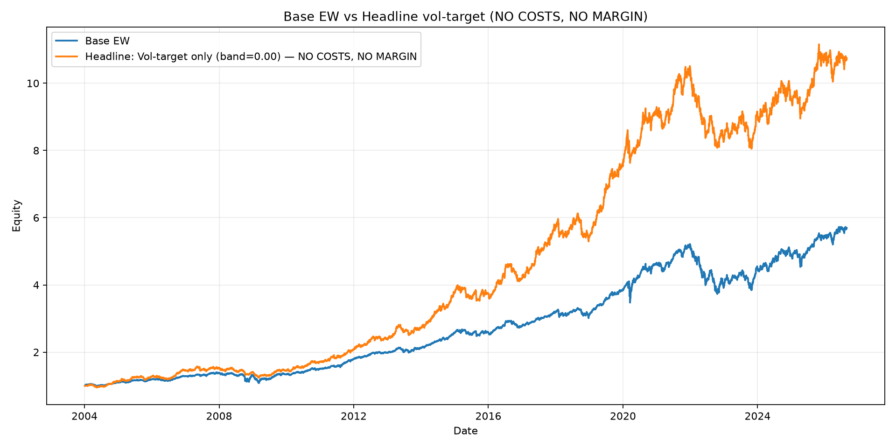
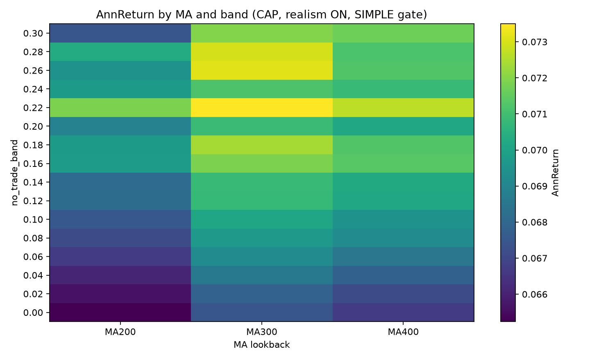
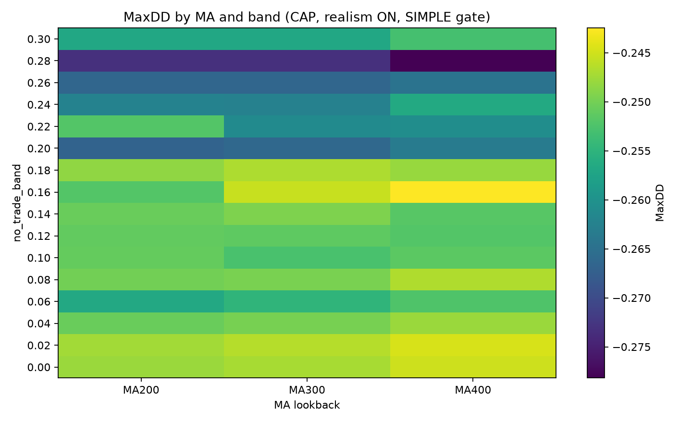
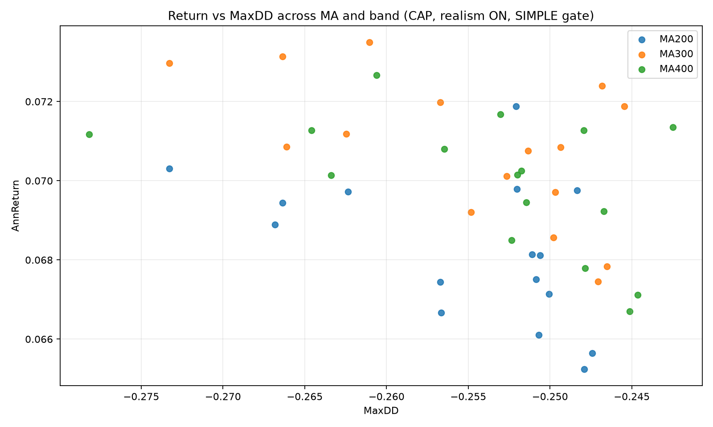
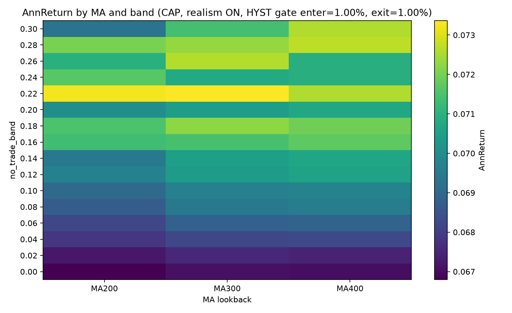
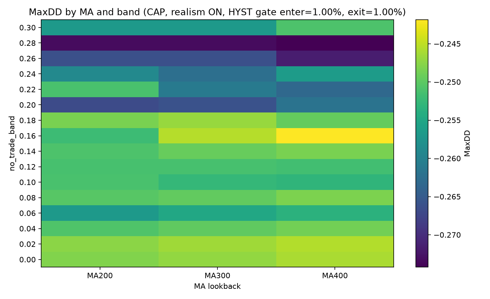
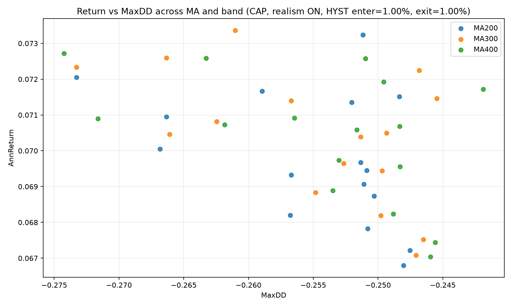
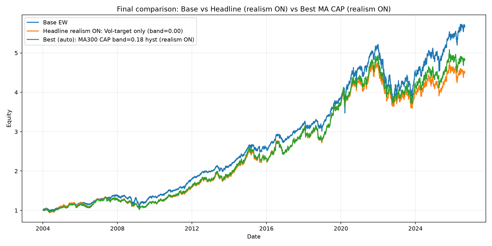

# QT/QR — Vol Targeting + MA CAP + Realistic Costs & Margin (Monthly Rebalance)

Run time: `2026-08-25T16:25:10`  

Output folder: `scenarios_2026-08-25_161358`

## Executive summary

This project builds a **from-scratch backtesting pipeline** for a levered volatility-target overlay on a 2-asset portfolio and evaluates it under increasing realism:
execution lag, real notional trading costs, financing costs via negative cash, and path-dependent maintenance margin deleveraging.

The main result is a **trade-off frontier**: leverage overlays can reduce tail risk (MaxDD) via de-risking rules (MA CAP), but **net returns are sensitive to financing and turnover**, and margin constraints cap achievable leverage.

This report provides:
- A best-case benchmark (no costs, no margin) to show the “physics” of the signal.
- A realism ladder to quantify how each friction compresses AnnReturn.
- A sweep across **MA200/300/400** and **no-trade band 0.00–0.30**, comparing **SIMPLE vs HYST** regime gating.
- An auto-selected “best” configuration and a borrow-rate sensitivity table.

## Design choices & conventions

**Monthly rebalance date:** first trading day of each month (trades executed at start of day *t* using information through *t−1*).  
**Execution lag:** leverage targets are shifted by one day to avoid lookahead.  
**Trading costs:** charged on **actual traded notional** across SPY and TLT (rebalance + leverage scaling + forced delever).  
**Financing (borrow) costs:** charged on **negative cash** (leveraged financing).  
**Margin realism:** initial margin caps leverage pre-trade; maintenance margin triggers **path-dependent forced deleveraging**.

## Parameters

**Universe:** ('SPY', 'TLT') with base weights (0.5, 0.5)  
**Vol-target:** target_vol=0.10, lookback=20d, max_leverage=3.0  
**Realistic costs:** borrow_annual=6.00%, trading_bps=10.0  
**Margin:** m_init=0.50, m_maint=0.30, buffer=0.05  
**MA sweep:** [200, 300, 400], band grid 0.00..0.30

## (A) Base benchmark (no leverage)

Base EW (equal-weighted in the sense of fixed weights (0.5, 0.5)) is the reference portfolio.
- AnnReturn: **0.0798**
- AnnVol: **0.0996**
- Sharpe: **0.8224**
- MaxDD: **-0.2850**

*Base EW equity curve*

## (B) Best-case benchmark: vol-target only (no costs, no margin)

This is a **best-case upper bound** for the overlay: it ignores financing, trading frictions, and margin constraints.
It is included to show what the signal could achieve *before* real-world implementation drag.

- AnnReturn: **0.1108**
- AnnVol: **0.1102**
- Sharpe: **1.0089**
- MaxDD: **-0.2341**

*Base EW vs vol-target (NO costs, NO margin)*

## (C) Realism ladder: where returns get compressed

We progressively add realism on the *same vol-target signal* to isolate drivers of performance drag:

- **Trading drag:** scales with actual notional turnover (monthly rebalance + leverage scaling + forced trades).
- **Financing drag:** scales with negative cash (borrowed funding).
- **Margin caps & forced deleveraging:** cap achievable leverage and can lock-in losses during drawdowns.

| index                        |   AnnReturn |   AnnVol |   Sharpe |   MaxDD |   ForcedLiqDays |   AvgLev |   AvgBorrowed |   AvgTurnover |   BandActive |   AvgGrossDaily |   AvgNetDaily |   AvgTradingCostDaily |   AvgBorrowCostDaily |   ΔAnnReturn_vs_A |
|------------------------------|-------------|----------|----------|---------|-----------------|----------|---------------|---------------|--------------|-----------------|---------------|-----------------------|----------------------|-------------------|
| A) NO COSTS, NO MARGIN       |      0.1108 |   0.1102 |   1.0089 | -0.2341 |               0 |   1.3925 |        1.7698 |        0.0546 |       0.9947 |          0.0004 |        0.0004 |                0      |               0      |            0      |
| B) Trading only, NO MARGIN   |      0.0956 |   0.1102 |   0.8835 | -0.2443 |               0 |   1.3925 |        1.4551 |        0.0546 |       0.9947 |          0.0004 |        0.0004 |                0.0001 |               0      |           -0.0152 |
| C) Borrow only, NO MARGIN    |      0.0819 |   0.1101 |   0.7699 | -0.2365 |               0 |   1.3927 |        1.1903 |        0.0546 |       0.9947 |          0.0004 |        0.0003 |                0      |               0.0001 |           -0.0289 |
| D) Trading+Borrow, NO MARGIN |      0.0671 |   0.1102 |   0.6445 | -0.2529 |               0 |   1.3927 |        0.9904 |        0.0546 |       0.9947 |          0.0004 |        0.0003 |                0.0001 |               0.0001 |           -0.0437 |
| E) Trading+Borrow, MARGIN ON |      0.069  |   0.1076 |   0.6735 | -0.2475 |               0 |   1.3521 |        0.9325 |        0.0427 |       0.8773 |          0.0004 |        0.0003 |                0      |               0.0001 |           -0.0418 |

### Realism ON vs Base (quick read)

| Variant                                          |   AnnReturn |   AnnVol |   Sharpe |   MaxDD |
|--------------------------------------------------|-------------|----------|----------|---------|
| Base EW                                          |      0.0798 |   0.0996 |   0.8224 | -0.285  |
| Headline realism ON (vol-target only, band=0.00) |      0.069  |   0.1076 |   0.6735 | -0.2475 |

## (D) Regime overlays: MA CAP sweeps across MA and no-trade band

We evaluate a regime overlay that prevents borrowing in risk-off regimes (MA CAP).  
We compare two gating rules:

- **SIMPLE gate:** risk-on if SPY ≥ MA, risk-off otherwise.
- **HYST gate:** uses entry/exit buffers around MA to reduce boundary churn (fewer flips).

The band parameter controls how aggressively leverage target changes are executed:
higher bands reduce turnover (lower trading costs) but can increase lag.

### SIMPLE gate (realism ON)

*AnnReturn heatmap (SIMPLE gate, realism ON)*

*MaxDD heatmap (SIMPLE gate, realism ON)*

*Return vs MaxDD scatter (SIMPLE gate, realism ON)*

### Hysteresis gate (realism ON)

*AnnReturn heatmap (HYST gate, realism ON)*

*MaxDD heatmap (HYST gate, realism ON)*

*Return vs MaxDD scatter (HYST gate, realism ON)*

### Robustness summary (stability across bands)

We label a configuration as “robust” if it simultaneously:
- achieves near-base return: **AnnReturn ≥ BaseAnnReturn − 0.005**
- improves tail risk: **MaxDD > BaseMaxDD**
- avoids margin events: **ForcedLiqDays = 0**

The table summarizes how many (band) choices satisfy that for each MA lookback.
Higher counts imply the result is less parameter-fragile.

|   ma |   n_total |   n_meets |   annret_mean |   annret_std |   annret_min |   annret_max |   maxdd_mean |   maxdd_std |   maxdd_best |   maxdd_worst |
|------|-----------|-----------|---------------|--------------|--------------|--------------|--------------|-------------|--------------|---------------|
|  200 |        32 |         0 |        0.069  |       0.002  |       0.0652 |       0.0732 |      -0.2551 |      0.0076 |      -0.2474 |       -0.2733 |
|  300 |        32 |         0 |        0.0706 |       0.0018 |       0.0671 |       0.0735 |      -0.255  |      0.0083 |      -0.2455 |       -0.2733 |
|  400 |        32 |         0 |        0.0702 |       0.0017 |       0.0667 |       0.0727 |      -0.2539 |      0.0091 |      -0.2419 |       -0.2782 |

## (E) Auto-selected best configuration + final comparison

Selection note: Selected max AnnReturn subject to MaxDD >= -0.25 and ForcedLiqDays=0.

Selected best (realism ON):
- **MA300 CAP**
- **gate_mode:** hyst
- **band:** 0.18

Final comparison below uses **headline realism ON** (not the no-cost benchmark), since that is the relevant baseline for implementable performance.

*Base vs Headline (realism ON) vs Best MA CAP (realism ON)*

| Variant                                          |   AnnReturn |   AnnVol |   Sharpe |   MaxDD |
|--------------------------------------------------|-------------|----------|----------|---------|
| Base EW (no leverage)                            |      0.0798 |   0.0996 |   0.8224 | -0.285  |
| Headline realism ON: Vol-target only (band=0.00) |      0.069  |   0.1076 |   0.6735 | -0.2475 |
| Best (auto): MA300 CAP (band=0.18) realism ON    |      0.0722 |   0.1062 |   0.7102 | -0.2468 |

## Borrow-rate sensitivity (best option vs Base EW)

We hold the auto-selected best configuration fixed and vary only the annual borrow rate.
This isolates the dependence of net performance on financing conditions.

Held fixed:
- MA lookback: **300**
- gate_mode: **hyst**
- band: **0.18**

|   index |   BorrowAnnual |   AnnReturn |   AnnVol |   Sharpe |   MaxDD |   ForcedLiqDays |   AvgLev |   AvgBorrowed |   AvgTurnover |   ΔAnnReturn_vs_Base |   ΔMaxDD_vs_Base |
|---------|----------------|-------------|----------|----------|---------|-----------------|----------|---------------|---------------|----------------------|------------------|
|       0 |           0.02 |      0.0879 |   0.1062 |   0.8464 | -0.2448 |               0 |   1.3212 |        1.1125 |        0.0234 |               0.0081 |           0.0402 |
|       1 |           0.04 |      0.08   |   0.1062 |   0.7777 | -0.2458 |               0 |   1.3212 |        1.0003 |        0.0234 |               0.0002 |           0.0392 |
|       2 |           0.06 |      0.0722 |   0.1062 |   0.7102 | -0.2468 |               0 |   1.3213 |        0.903  |        0.0234 |              -0.0076 |           0.0382 |
|       3 |           0.08 |      0.0647 |   0.1062 |   0.644  | -0.2478 |               0 |   1.3213 |        0.8183 |        0.0234 |              -0.0151 |           0.0372 |

## (F) Conclusions

1) **Best-case vs implementable reality:** the no-cost/no-margin benchmark can look strong, but it is not tradable as-is.  
2) **Why returns compress under realism:** trading drag (turnover), financing drag (negative cash), and margin caps/forced deleveraging are first-order effects under leverage.  
3) **What MA CAP is doing:** it improves tail behavior by removing borrowed exposure in sustained risk-off regimes, but this reduces participation during recoveries (a structural trade-off).  
4) **Robustness matters:** the sweep + robustness counts show whether improvements persist across reasonable parameter settings rather than a single tuned point.  
5) **Practical takeaway:** treat this as a *risk overlay research framework*. Any claim of “outperformance” must be evaluated under realistic financing and execution assumptions, and should be stress-tested across borrow/trading cost regimes.
